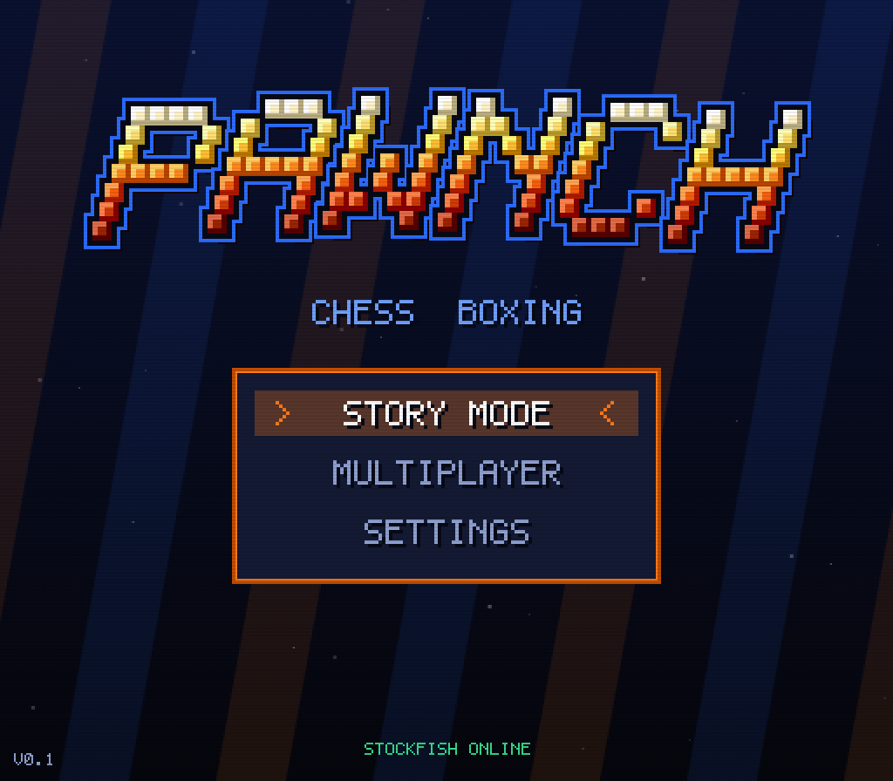
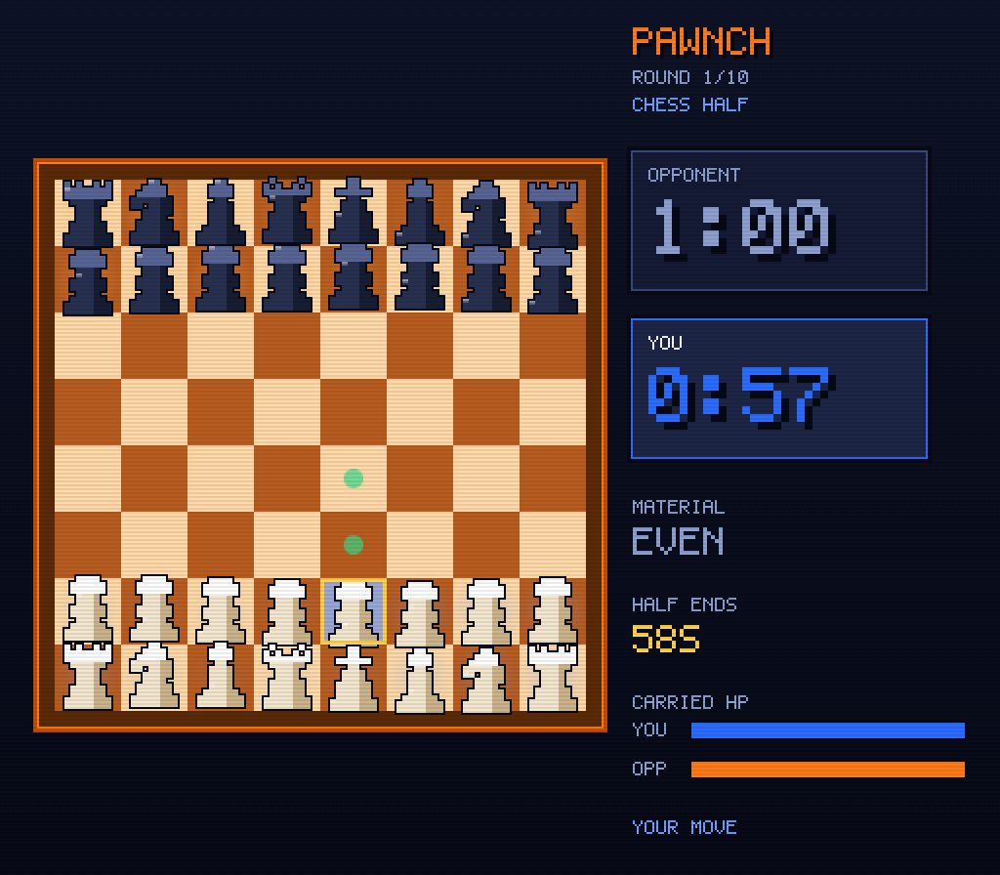
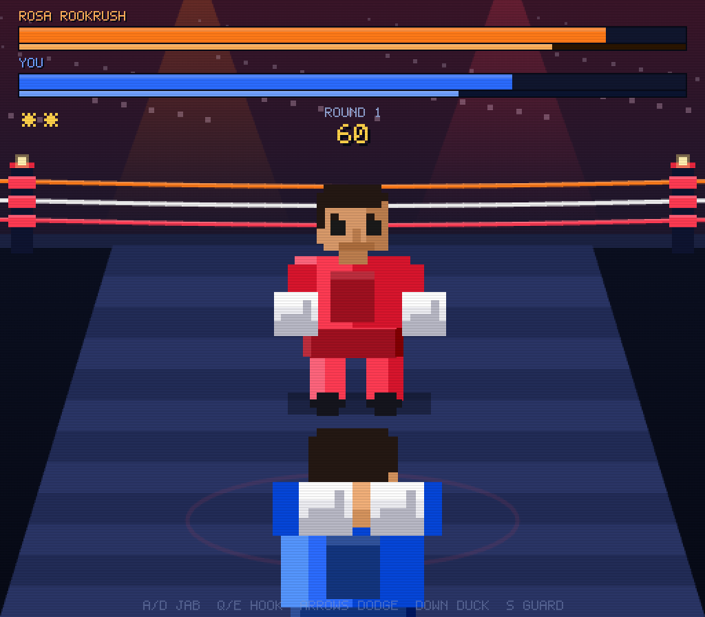

# PAWNCH 🥊♟️

**Chess boxing, 16-bit style.** Face off across the board for a minute, then
throw down in the ring for a minute. Win *either* the chess **or** the boxing
and you take the whole match. Ten rounds. One champion.

### ▶︎ [**Play it in your browser → heyimb3.github.io/PAWNCH**](https://heyimb3.github.io/PAWNCH/)

<p align="center">
  
  
  
</p>

> Click or press a key first — browsers need a gesture before the audio can
> start. Story Mode and local hotseat work on the live link; online multiplayer
> needs a server (see [docs/HOSTING.md](docs/HOSTING.md)).

Built in the spirit of classic 16-bit boxing games (the dodge/jab/hook feel) and
arcade-fighter title screens. Clean, open (MIT), and easy to keep iterating
toward a Steam release. All art + audio are **procedurally generated placeholders**
(orange & blue palette) meant to be repainted in Aseprite later.

---

## Quick start

This is a static, dependency-free browser game using ES modules, so it needs to
be served over `http://` (not opened as a `file://`).

```bash
# from the project root — pick one:
python3 -m http.server 5173      # then open http://localhost:5173
npx serve -l 5173 .              # or any static server
```

Then open the URL and click / press a key (browsers require a gesture before
audio can start).

- **F** — fullscreen
- **M** — mute/unmute music (shows now-playing)
- Title screen: **Arrows/WASD** move, **Enter/Space** select.

### Online multiplayer (optional)

Online play needs the bundled relay server running:

```bash
cd server
npm install
node server.js          # ws://localhost:8080
```

Then in two browser tabs/machines choose **Multiplayer → Online Match**. The
chess half is fully synced (deterministic move relay); the boxing half uses a
local-authority action relay (**beta**).

---

## Controls

**Menus / Chess**
| Input | Action |
| --- | --- |
| Arrows / WASD | Move cursor |
| Enter / Space | Select / pick piece / move |
| Esc | Cancel / back |
| **Mouse — drag** | Pick a piece up and drop it on a square (with pick-up/settle physics) |
| **Mouse — click** | Click a piece, then click a destination (point-and-click) |

> Controls are **fully rebindable** in Settings → Controls. Chess pieces are
> centered on their squares with a magical glow/float and animate when moved.

**Boxing (Punch-Out style)**
| Key | Action |
| --- | --- |
| A / D | Left / right **jab** |
| Q / E | Left / right **hook** |
| ← / → | **Dodge** left / right |
| ↓ | **Duck** |
| Shift / S | **Guard** (block) |

- **Dodge an attack, then punch** during their recovery = **counter** → earns a **star**.
- Throw a **hook while you have a star** = a big **uppercut**.
- Watch the **tell** above the opponent during their windup: side arrow + **HIGH/LOW**.
  **Duck beats HIGH shots**, dodge the correct side beats anything, guard just softens it.
- Each opponent has a heavy, slow **SIGNATURE** haymaker (flashing red warning) — read it and slip.
- **Stamina** (thin bar under each HP bar) drains as you punch/dodge and regens when idle;
  fighting tired = weaker hits and slower recovery. **Combos** chain if you keep landing hits.

**Local hotseat Player 2:** F/H jab · T/U hook · G/J dodge · B duck · V guard.

---

## Match rules (all in one place: `src/game.js`)

- A **round** = a chess half (1 min) **then** a boxing half (1 min).
- **Win chess OR boxing → win the whole match immediately.**
  - Chess decisive: **checkmate**, or the opponent **flags** (clock hits 0).
  - Boxing decisive: **KO**.
- The chess game is **one continuous game** across rounds — **both the position
  and the clocks persist**, so each chess half resumes exactly where you left
  off. Each player has a single continuous clock (60s + a small Fischer
  increment per move), and each round's chess half is a ~60s wall-time window.
- Make it to a **new round** and both fighters recover **10–15% HP**.
- After **10 rounds** with no KO/mate, the higher **chess material** wins.
- **Crossover:** your chess **material lead carries into the ring** — every ~3 points of
  edge grants the leader a starting **star** (shown on the boxing intro nameplate).

## Opponents (Story Mode)

10 opponents, climbing in **both** chess ELO and boxing skill. ELO runs
400 → 600 → … → 2000 (capped at 2000), with a final champion at 2000 and max
fight difficulty. Edit `src/opponents.js` to tune the ladder. Bots think for a
random **1–7s** per move (so they burn clock like a human) and play with an
ELO-scaled blunder rate.

> Note: 400 + 200×9 = 2200, but you asked for a 2000 cap, so #9 and #10 both sit
> at 2000 (the champion is the harder *boxer*). Easy to change in the roster.

---

## Architecture

```
index.html            canvas shell
css/style.css         letterboxed, pixel-crisp container
src/
  main.js             bootstrap + engine warm-up + fullscreen
  game.js             game loop, state machine, MATCH model + win rules
  config.js           tuning knobs + the orange/blue palette
  input.js            remappable, edge-detected keyboard input
  save.js             localStorage (progress + settings)
  audio.js            chiptune engine (square/tri/noise) + SFX + 2 songs
  gfx.js              5x7 pixel font, UI panels, logo, sprites, particles
  boxing.js           Punch-Out-style fight sim (story / pvp / net)
  net.js              online client (WebSocket)
  opponents.js        the 10-fighter roster + palettes
  chess/
    board.js          full legal chess rules (FEN, castling, ep, promo, mate)
    ai.js             built-in engine (alpha-beta + ELO scaling)
    engine.js         Stockfish-WASM-or-built-in, with humanized think time
  states/
    title.js settings.js story.js walk.js chess.js
    boxing.js roundbreak.js matchend.js multiplayer.js
server/
  server.js           Node WebSocket matchmaking + relay (run separately)
```

**Chess brain:** `chess/engine.js` tries to load Stockfish (WASM) from a CDN for
strong, ELO-accurate play; if that fails (offline), it falls back to the
built-in JS engine in `chess/ai.js`. Either way it returns a move plus a
humanized 1–7s think time.

**No build step.** Plain ES modules. Swap the procedural assets for real
sprites/audio by replacing the draw calls in `gfx.js` / `audio.js`.

---

## Tools

- **`tools/sprite-gen.html`** — open it via the dev server
  (`http://localhost:5173/tools/sprite-gen.html`). It renders every boxer pose +
  chess piece to transparent PNG frames, gives per-frame downloads (and a
  "Download all"), and emits a ready `manifest.json`. Drop the PNGs into
  `assets/sprites/`, save the manifest there, and the game uses your art —
  perfect starting frames to repaint in Aseprite.
- **`tools/devserver.py`** — a no-cache static server (`python3 tools/devserver.py`)
  so module edits always take effect on reload.

## Roadmap / ideas

**Done in v0.1:** promotion picker · per-opponent ring backdrops · signature
punches · stamina + head/low targeting + star uppercut · chess→boxing material
crossover · hit-stop, combos, crowd reactions, intro nameplate · netcode
keepalive + token rejoin/reconnect · mouse drag + click chess control with
pickup/settle physics · magical centered pieces · more human caricature boxers ·
ornate ring · dedicated arcade-fight music · **Aseprite sprite-sheet loading**
(see `assets/sprites/`) · **in-game key remapping** · **PGN export** of the
chess game (press P on the result screen).

**Still ahead:**
- Hand-drawn Aseprite art to replace the procedural placeholders (loader is ready).
- Server-authoritative or rollback boxing netcode (current online relay is beta).
- Accessibility (colorblind palettes), difficulty options, commentary VO.
- Electron/Tauri wrapper for the Steam build.

## License

MIT — make it your own.
